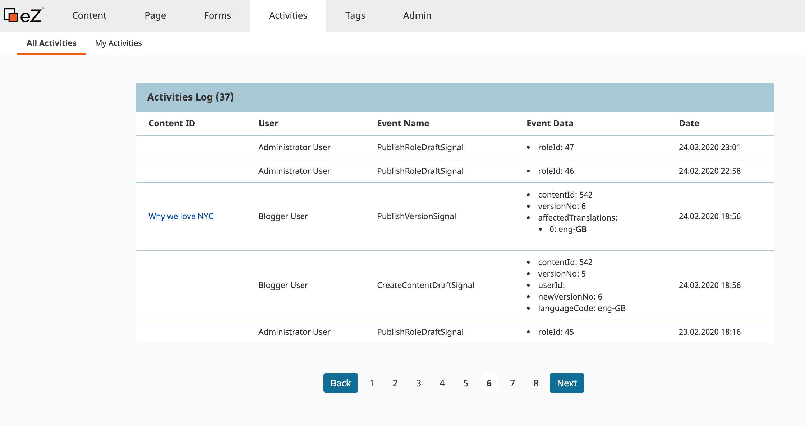
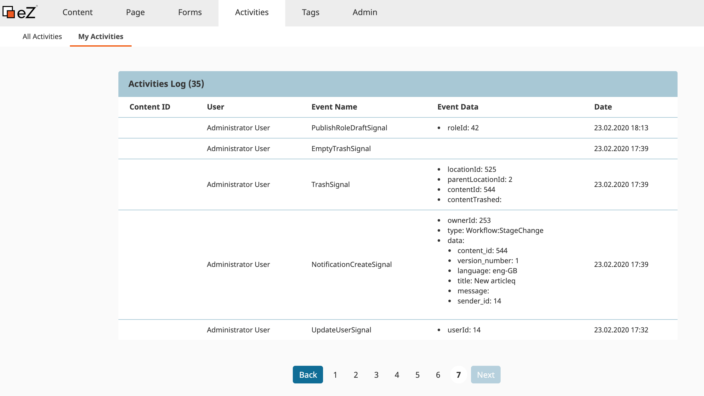
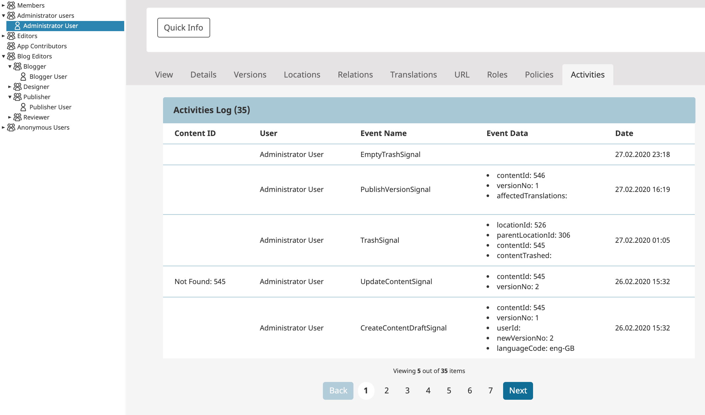

# ezplatform Activities Log Bundle

This bundle allows you to log user and system events from the UI or using API. See screenshots
It is a lightweight implementation compared to [EdgarEzUIAuditBundle](https://github.com/noodle69/EdgarEzUIAuditBundle) which provide more details.

## Requirement

eZPlatform 2.x +

## Features

- All user and system activities based on ezplatform signals
- Current logged in user activities
- Activities on user level
- Several policies to allow user the access to the activities panels
 
## Installation

```
composer require arfaram/ezplatform-activities-log
```

- Activate the Bundle in AppKernel.php

```
    public function registerBundles()
    {
        $bundles = array(
            //...
            new EzPlatform\ActivitiesLogBundle\EzPlatformActivitiesLogBundle(),

```

- app/config/routing.yml

```
ez_platform_activities_log:
    resource: "@EzPlatformActivitiesLogBundle/Resources/config/routing.yml"
    prefix:   /
```

### Validate mapping
```
 php bin/console doctrine:schema:validate
```

### Create the database table

```
php bin/console doctrine:schema:update --force
```

## Screenshots









