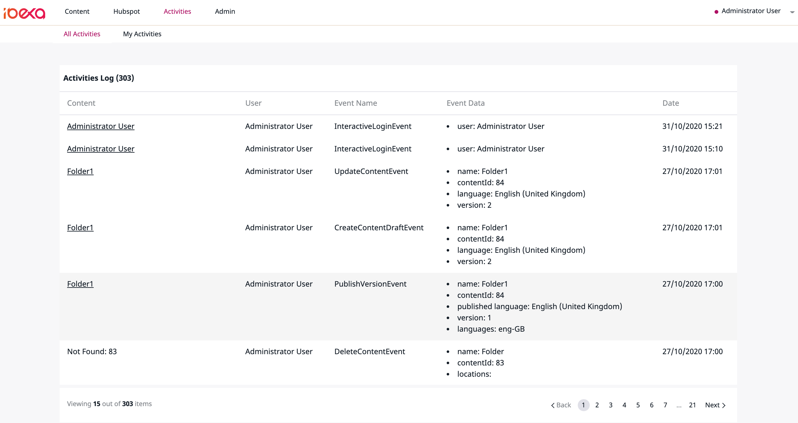
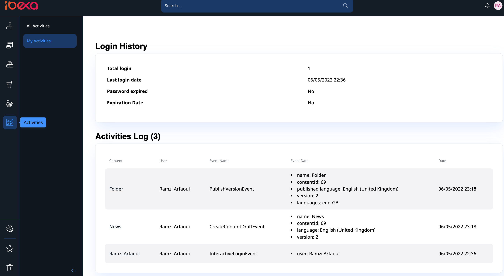
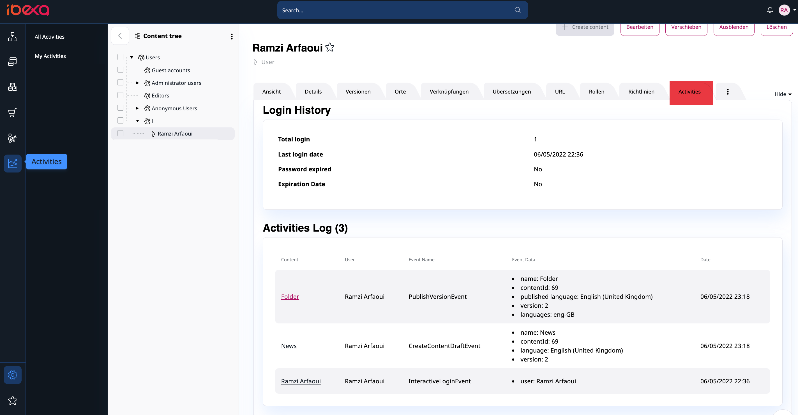

# eZ Platform ActivitiesLog Bundle

This bundle allows you to log user and system events from the UI or using API. See screenshots.

It is a lightweight implementation compared to [EdgarEzUIAuditBundle](https://github.com/noodle69/EdgarEzUIAuditBundle) (!only for eZ Platform 2.x) which provide more details. 

## Requirement

eZ Platform **3.x +**

>Please Note that this bundle is also available for eZ Platform 2.x then you have to use `arfaram/ezplatform-activities-log:^1.0` when using `composer require` and read the README file corresponding to version 1.x 

## Features

- Content ~~All user and system~~ activities based on ezplatform AfterEvent (* See limitations)
- Current logged in user activities
- Activities on user level
- Several policies to allow user the access to the activities panels
- New in 2.1: user Login History, see CHANGELOG file for more details or see screeshots below


## Limitations
(*) in eZ Platform 2.x it was possible to trigger all API events based on `MVCEvents::API_SIGNAL`. The Signal provides an object and it was easy to serialize it and save it in the DB. EZ Platform 3 introduces `Before` and `After` Events which provide several objects like content, contentInfo, VersionInfo etc. So it is no longer possible to serialize these objects anymore. On one hand it is easy to gather a lot of information from the several Events but on the other hand it makes the EventSubsriber implementation very long.

- In this version I started only with content AfterEvents:
    - HideContentEvent
    - RevealContentEvent
    - CopyContentEvent
    - DeleteVersionEvent
    - DeleteContentEvent
    - CreateContentDraftEvent
    - UpdateContentEvent
    - PublishVersionEvent

Other `AfterEvents` will be added gradually :) best way to learn eZ Platform. Any contribution is welcome
 
## Installation

```
composer require arfaram/ezplatform-activities-log
```

- Activate the Bundle in `bundles.php`

```
EzPlatform\ActivitiesLogBundle\EzPlatformActivitiesLogBundle::class => ['all' => true],
```

- Add `config/routes/ez_platform_activities_log.yaml`  

```
ez_platform_activities_log:
    resource: "@EzPlatformActivitiesLogBundle/Resources/config/routing.yaml"
    prefix:   /
```

### Validate mapping
```
 php bin/console doctrine:schema:validate
```

### Create the database table

```
php bin/console doctrine:schema:update --force
```

Note: use `doc/mysql.sql` to create the DB `activities_log` table if you got some doctrine issues 

## Override pagination values

Add you pagination value to `.env` file:

```
# Activities menus(all, me)
ACTIVITIESLOG_PAGINATION_LIMIT=XX

#activity user tab menu in location view
ACTIVITIESLOG_USER_TAB_PAGINATION_LIMIT=XX
```

or use parameters:

```
parameters:
    env(ACTIVITIESLOG_PAGINATION_LIMIT): XX
    env(ACTIVITIESLOG_USER_TAB_PAGINATION_LIMIT): XX
```

Defaut values are 15 for both.

## Screenshots









