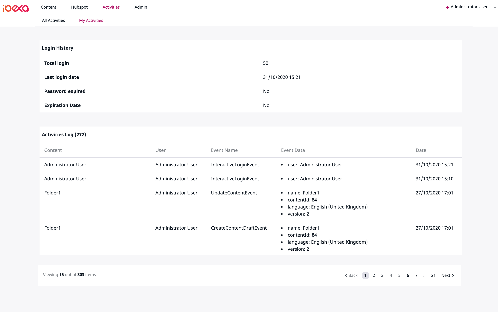
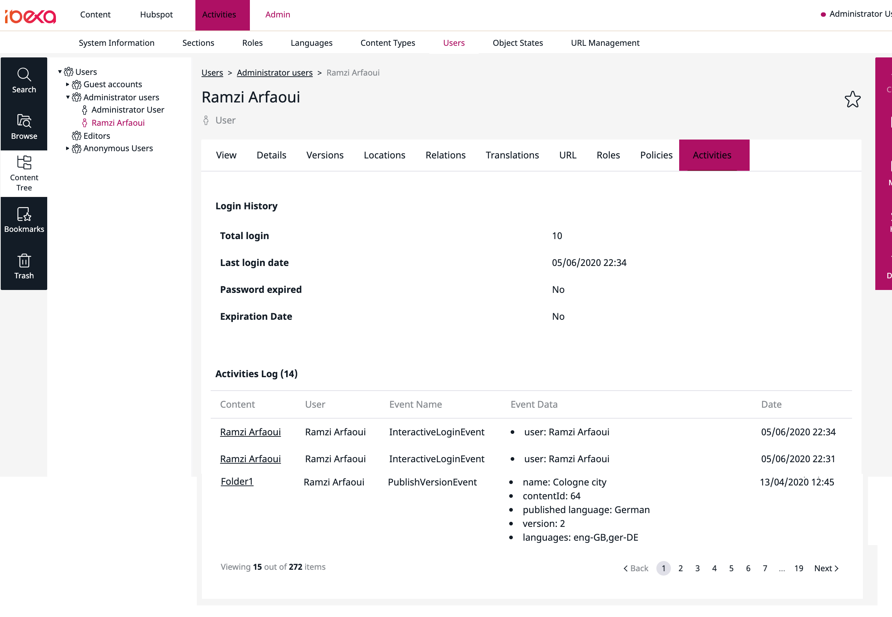

[](https://github.com/arfaram/ezplatform-activities-log/tags)
[](https://packagist.org/packages/arfaram/ezplatform-activities-log)
[](https://github.com/arfaram/ezplatform-activities-log/blob/master/LICENSE)

# Available also in premium version with more set of features: [more infos](https://ramzi-arfaoui.de/ez-platform-ibexa-bundles/)

# eZ Platform / Ibexa ActivitiesLog Bundle (open source)

This bundle allows you to log user and system events from the UI or using API. See screenshots.

It is a lightweight implementation compared to [EdgarEzUIAuditBundle](https://github.com/noodle69/EdgarEzUIAuditBundle) (!only for eZ Platform /Ibexa 2.x) which provide more details. 

## Requirement

Ibexa **4.x +**

>Note that this bundle is also available for eZ Platform 3.2. You have to require `arfaram/ezplatform-activities-log:^3.2` and read the README file corresponding to version 3.2 

>Note that this bundle is also available for eZ Platform 3.0 and 3.1. You have to require `arfaram/ezplatform-activities-log:^2.1` and read the README file corresponding to version 2.x 

>Note that this bundle is also available for eZ Platform 2.x. You have to require `arfaram/ezplatform-activities-log:^1.0` and read the README file corresponding to version 1.x 

## Features

- Content activities based on ibexa AfterEvent (* See limitations)
- Current logged-in user activities
- Activities on user level
- Several policies to allow user the access to the activities panels
- User Login History, see CHANGELOG file for more details or see screeshots below


## Limitations
(*) in eZ Platform 2.x it was possible to trigger all API events based on `MVCEvents::API_SIGNAL`. The Signal provides an object and it was easy to serialize it and save it in the DB. Ibexa 3 introduces `Before` and `After` Events which provide several objects like content, contentInfo, VersionInfo etc. So it is no longer possible to serialize these objects anymore. On one hand it is easy to gather a lot of information from the several Events but on the other hand it makes the EventSubscriber implementation very long.

- This version supports:
    - HideContentEvent
    - RevealContentEvent
    - CopyContentEvent
    - DeleteVersionEvent
    - DeleteContentEvent
    - CreateContentDraftEvent
    - UpdateContentEvent
    - PublishVersionEvent

Other `Events` will be added gradually :)  Any contribution is welcome
 
## Installation

```
composer require arfaram/ezplatform-activities-log
```

- Activate the Bundle in `bundles.php`

```
EzPlatform\ActivitiesLogBundle\EzPlatformActivitiesLogBundle::class => ['all' => true],
```

- Add `config/routes/ez_platform_activities_log.yaml`  

```
ez_platform_activities_log:
    resource: "@EzPlatformActivitiesLogBundle/Resources/config/routing.yaml"
    prefix:   /
```

### Validate mapping
```
 php bin/console doctrine:schema:validate
```

### Dump SQL
```
php bin/console doctrine:schema:update --dump-sql
```

### Create the database table

```
php bin/console doctrine:schema:update --dump-sql --force
```

Note: use `doc/mysql.sql` to create the DB `activities_log` table if you got some doctrine issues 

## Override pagination values

Add your pagination value to `.env` file:

```
# Activities menus(all, me)
ACTIVITIESLOG_PAGINATION_LIMIT=XX

#activity user tab menu in location view
ACTIVITIESLOG_USER_TAB_PAGINATION_LIMIT=XX
```

or use parameters:

```
parameters:
    env(ACTIVITIESLOG_PAGINATION_LIMIT): XX
    env(ACTIVITIESLOG_USER_TAB_PAGINATION_LIMIT): XX
```

Default values are 15 for both.

## Screenshots


- Note: Login history will be displayed after installing the bundle and first login






